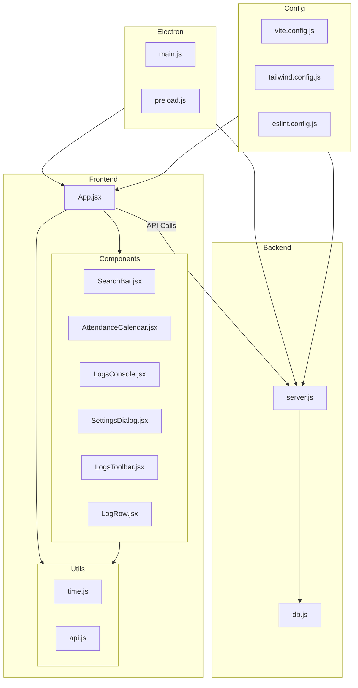

    

    <b>Automatic Architecture Diagrams from Code</b> 
    <a href="https://github.com/swark-io/swark">GitHub</a> • <a href="https://swark.io">Website</a> • <a href="mailto:contact@swark.io">Contact Us</a>

## Usage Instructions

1. **Render the Diagram**: Use the links below to open it in Mermaid Live Editor, or install the [Mermaid Support](https://marketplace.visualstudio.com/items?itemName=bierner.markdown-mermaid) extension.
2. **Recommended Model**: If available for you, use `claude-3.5-sonnet` [language model](vscode://settings/swark.languageModel). It can process more files and generates better diagrams.
3. **Iterate for Best Results**: Language models are non-deterministic. Generate the diagram multiple times and choose the best result.

## Generated Content
**Model**: GPT-4o - [Change Model](vscode://settings/swark.languageModel)  
**Mermaid Live Editor**: [View](https://mermaid.live/view#pako:eNp9VNtu2zAM_RVDz20_IA8F2qQDCnRAMGd7kffAyIyjVpYEiW43tP330bc4ctwJMEyec3Qok0rehXIlipUobBXAH7PdprAZr9jse-BbcJbQlj3crjvvJT83z_HP7wk9bVi72juLluJEtitHCOp4D0GeoplFZ05tMbAK12DaKMhLaGHfk6vi2tnoDMqzeEGZI5G2VdxoMK6SafqF8845s-ejnMXLyh_uTfavGZ908NSrn6TNrE07XWMHS-KIXeYN8rqnweuUPZXogtkY70G9JGcYgBzDKwYZu1fqtwGCPUSU5X4ilrwfDCriazJt_Q7aboNTGKOsOU6NtwGNgzJXQXuSvs_-X4LHedDVZPFLE_aYfOXwRnVxWmYH2rxpWw46GtJF7UP-pC0NSoyGkwvd2bn4-mfX17cXd33Ez-Y6SebMIP642z5mfLNN_EiH0qsSqLMY59LzY_M7amF_wnPJ8VTtt32JzXzElagx8CBL_qd4LwQdscZCrLJClHiAxlAhPlnU-BII-ZfEQ6vFikKDVwIacvlfq8Y8uKY6itUBTMTPf9aTblk) | [Edit](https://mermaid.live/edit#pako:eNp9VNtu2zAM_RVDz20_IA8F2qQDCnRAMGd7kffAyIyjVpYEiW43tP330bc4ctwJMEyec3Qok0rehXIlipUobBXAH7PdprAZr9jse-BbcJbQlj3crjvvJT83z_HP7wk9bVi72juLluJEtitHCOp4D0GeoplFZ05tMbAK12DaKMhLaGHfk6vi2tnoDMqzeEGZI5G2VdxoMK6SafqF8845s-ejnMXLyh_uTfavGZ908NSrn6TNrE07XWMHS-KIXeYN8rqnweuUPZXogtkY70G9JGcYgBzDKwYZu1fqtwGCPUSU5X4ilrwfDCriazJt_Q7aboNTGKOsOU6NtwGNgzJXQXuSvs_-X4LHedDVZPFLE_aYfOXwRnVxWmYH2rxpWw46GtJF7UP-pC0NSoyGkwvd2bn4-mfX17cXd33Ez-Y6SebMIP642z5mfLNN_EiH0qsSqLMY59LzY_M7amF_wnPJ8VTtt32JzXzElagx8CBL_qd4LwQdscZCrLJClHiAxlAhPlnU-BII-ZfEQ6vFikKDVwIacvlfq8Y8uKY6itUBTMTPf9aTblk)

